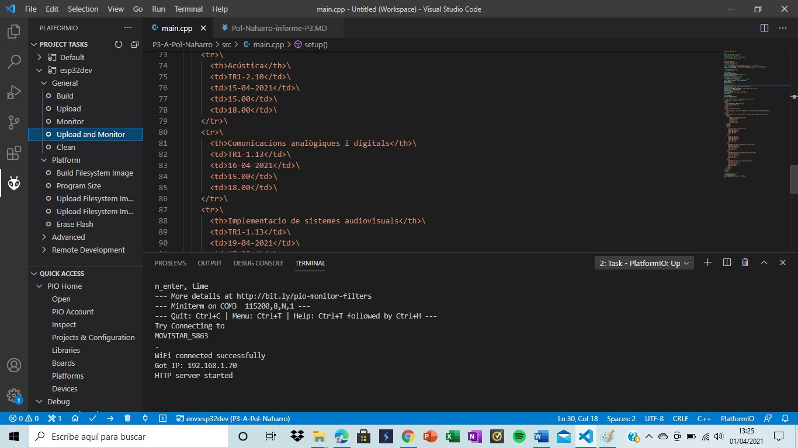
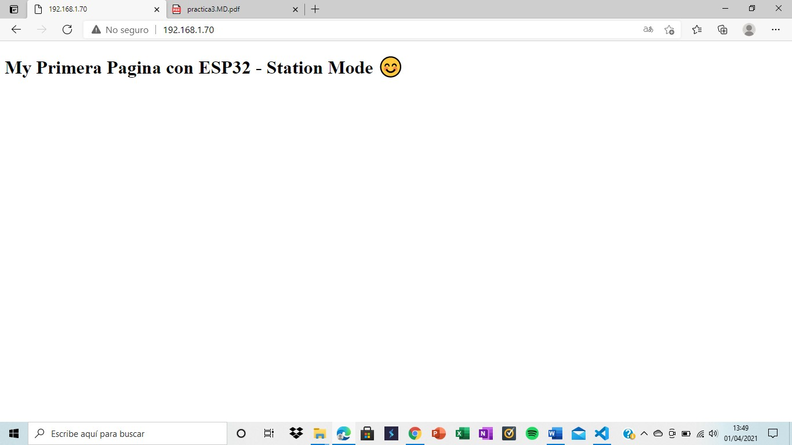
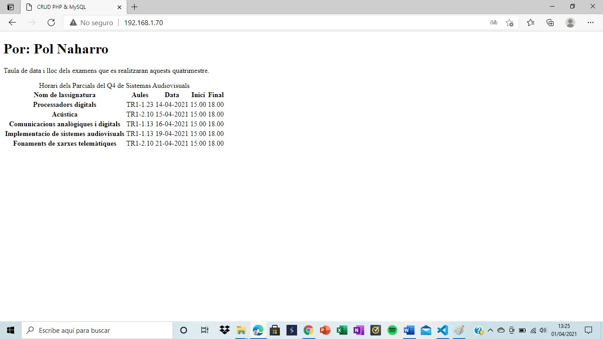

Pol Naharro
## PRACTICA 3 : WIFI y BLUETOOTH PARTE A

##### Código Practica A: 

```
#include <Arduino.h>

/*
ESP32 Web Server - STA Mode
modified on 25 MAy 2019
by Mohammadreza Akbari @ Electropeak
https://electropeak.com/learn
*/

#include <WiFi.h>
#include <WebServer.h>
// SSID & Password
const char* ssid = "MOVISTAR_F7F4"; // Enter your SSID here
const char* password = "SyjZiDCXYinxga2Me4eb"; //Enter your Password here
WebServer server(80); // Object of WebServer(HTTP port, 80 is defult)

void handle_root(void);


void setup() {
Serial.begin(115200);
Serial.println("Try Connecting to ");
Serial.println(ssid);
// Connect to your wi-fi modem
WiFi.begin(ssid, password);
// Check wi-fi is connected to wi-fi network
while (WiFi.status() != WL_CONNECTED) {
delay(1000);
Serial.print(".");
}
Serial.println("");
Serial.println("WiFi connected successfully");
Serial.print("Got IP: ");
Serial.println(WiFi.localIP()); //Show ESP32 IP on serial
server.on("/", handle_root);
server.begin();
Serial.println("HTTP server started");
delay(100);
}
void loop() {
server.handleClient();
}
// HTML & CSS contents which display on web server
String HTML = "<!DOCTYPE html>\
<html>\
<body>\
<h1>My Primera Pagina con ESP32 - Station Mode &#128522;</h1>\
</body>\
</html>";
// Handle root url (/)
void handle_root() {
server.send(200, "text/html", HTML);
}
```

##### Explicación:

###### Practica A: 

La primera parte de esta práctica es guardar nuestro wifi con su contraseña para poder llamarlo más adelante con las instrucciones siguientes
const char* ssid = "MOVISTAR_F7F4"; i const char* password = "SyjZiDCXYinxga2Me4eb";. Y después declaramos nuestro server WebServer server(80);.

A continuación hacemos el setup que comienza con la instrucción Serial.begin(115200); que nos permite ver los datos por el monitor. A continuación viene el bloque de comandos que nos sacará por pantalla el intento de conectar el wifi y si lo ha conseguido seguido del IP y de la frase "HTTP server started". Mientras hace esto hay instrucciones (WiFi.begin(ssid, password); y server.on("/", handle_root); server.begin(); ) que lo que hacen es conectarnos el wifi y después el servidor.

El loop conecta con el server y, por último, declaramos nuestro HTML y lo guardamos en el server con la siguiente instrución void handle_root() {server.send(200, "text/html", HTML);}.

En resumen, como podemos ver, este código conecta con el wifi, que comparte el dispositivo que lo genera, y nos genera una página con el contenido que nosotros le indicamos. 

##### Funcionamiento de la práctica:

###### Practica A
Comprobación en ordenador:

Comprobación en página web:

Comprobación en página web mejorada:


##### Código editado
```
#include <Arduino.h>

/*
ESP32 Web Server - STA Mode
modified on 25 MAy 2019
by Mohammadreza Akbari @ Electropeak
https://electropeak.com/learn
*/

#include <WiFi.h>
#include <WebServer.h>
// SSID & Password
const char* ssid = "MOVISTAR_5863"; // Enter your SSID here
const char* password = "28vcTuh9WXePa2Fq58zj"; //Enter your Password here
WebServer server(80); // Object of WebServer(HTTP port, 80 is defult)

void handle_root(void);


void setup() {
Serial.begin(115200);
Serial.println("Try Connecting to ");
Serial.println(ssid);
// Connect to your wi-fi modem
WiFi.begin(ssid, password);
// Check wi-fi is connected to wi-fi network
while (WiFi.status() != WL_CONNECTED) {
delay(1000);
Serial.print(".");
}
Serial.println("");
Serial.println("WiFi connected successfully");
Serial.print("Got IP: ");
Serial.println(WiFi.localIP()); //Show ESP32 IP on serial
server.on("/", handle_root);
server.begin();
Serial.println("HTTP server started");
delay(100);
}
void loop() {
server.handleClient();
}
// HTML & CSS contents which display on web server
String HTML = "<!DOCTYPE html>\
<html>\
<head>\
	<title>CRUD PHP & MySQL</title>\
	<meta charset='UTF-8'>\
</head>\
<body>\
<h1> Por: Pol Naharro </h1>\
  <p>\
    Taula de data i lloc dels examens que es realitzaran aquests quatrimestre.\
  </p>\
<table>\
  <caption>Horari dels Parcials del  Q4 de Sistemas Audiovisuals</caption>\
  <thead>\
    <tr>\
        <th>Nom de lassignatura</th>\
        <th>Aules</th>\
        <th>Data</th>\
        <th>Inici</th>\
        <th>Final</th>\
    </tr>\
  </thead>\
   <tbody>\
    <tr>\
      <th>Processadors digitals</th>\
      <td>TR1-1.23</td>\
      <td>14-04-2021</td>\
      <td>15.00</td>\
      <td>18.00</td>\
    </tr>\
    <tr>\
      <th>Acústica</th>\
      <td>TR1-2.10</td>\
      <td>15-04-2021</td>\
      <td>15.00</td>\
      <td>18.00</td>\
    </tr>\
    <tr>\
      <th>Comunicacions analògiques i digitals</th>\
      <td>TR1-1.13</td>\
      <td>16-04-2021</td>\
      <td>15.00</td>\
      <td>18.00</td>\
    </tr>\
    <tr>\
      <th>Implementacio de sistemes audiovisuals</th>\
      <td>TR1-1.13</td>\
      <td>19-04-2021</td>\
      <td>15.00</td>\
      <td>18.00</td>\
    </tr>\
    <tr>\
      <th>Fonaments de xarxes telemàtiques</th>\
      <td>TR1-2.10</td>\
      <td>21-04-2021</td>\
      <td>15.00</td>\
      <td>18.00</td>\
    </tr>\
    </tbody>\
</table>\
</body>\
</html>";

// Handle root url (/)
void handle_root() {
server.send(200, "text/html", HTML);
}

```